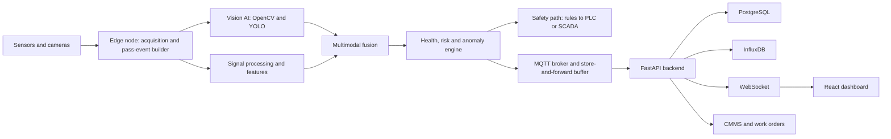

# NEXVION: Conveyor Belt Joint Health & Predictive Maintenance Platform

**Product Requirements Document, v2.0 (expanded)**
SIH 2026, PS ID 26008, Theme: Smart Automation, Category: Software/Hardware
Team NEXVION. Prepared 21 Sep 2026.

> **What changed from v1.** v1 described the dashboard. v2 keeps all 13 pages and adds the engineering that makes them believable: a *pass-event* data model (how a joint's data is actually captured), a transparent health-index and fusion method, false-alarm control, honest RUL handling, a simulation engine for the demo, a sensor tiering that reconciles the PRD with your SIH deck, security/safety boundaries, evaluation metrics, and a **verified dataset catalogue with links** (Section 14). Priorities are tagged **P0** (SIH demo), **P1** (pilot), **P2** (fleet).

---

## 1. Product summary

**One line:** NEXVION continuously inspects every splice/joint on a mining conveyor belt, fuses camera and sensor evidence into a per-joint health score, predicts when a joint will need attention, and turns that into alerts and maintenance work orders.

**Loop:** MONITOR → DETECT → UNDERSTAND → PREDICT → ALERT → MAINTAIN → LEARN

**Ten-second questions the home screen must answer**
1. Is the conveyor running, and is the data live?
2. Which joint (if any) needs attention, and where along the belt is it?
3. What is wrong, and how sure is the system?
4. Is it getting worse, and how fast?
5. What should maintenance do, and by when?

### Goals
- Detect joint and belt damage early enough to plan maintenance instead of reacting to a breakdown.
- Reduce false alarms through multi-sensor corroboration and persistence, not single-threshold alarms.
- Give every alert an explanation an operator can check.
- Work with limited failure data (anomaly detection + simulation + continuous learning), as stated in the deck.
- Keep working when the network drops (edge-first).

### Non-goals
- The dashboard is **not** a safety system. Emergency stop and rip protection stay on hard-wired PLC/SCADA logic. NEXVION sends advisory and trip-request signals through the safety path and never replaces it.
- No claim of certified SIL/PL rating in the prototype.
- No claim of validated RUL accuracy without run-to-failure evidence.

### Design principles
1. **Evidence over scores.** Every number links to the observations behind it.
2. **Honest uncertainty.** Show confidence, data provenance (REAL / PUBLIC-PROXY / SIMULATED) and model status everywhere.
3. **Calm by default.** Colour is reserved for abnormal states (ISA-101 style high-performance HMI); alarms are rationalised (ISA-18.2 principles).
4. **Edge-first, cloud-optional.** Critical processing never depends on the server.
5. **Modular sensors.** The software works with whichever sensor subset the hardware provides.

---

## 2. Reconciling the PRD with your SIH deck

Your deck and v1 list slightly different sensors. Pick one story before judging.

| Source | Sensors named |
|---|---|
| SIH deck (slide 3) | AI vision camera (HD, 30 FPS), laser beam scanner (3D profile), load cells (tension), ultrasonic transducers (internal flaws) |
| SIH deck (slide 4) | "RGB + Thermal fusion" for variable lighting |
| PRD v1 | RGB, thermal, vibration, acoustic, tension, speed, load |

**Resolution: a tiered sensor abstraction.** The software defines sensor *capabilities*, not brands, so any tier plugs in.

| Tier | Sensors | Role | Priority |
|---|---|---|---|
| T1 core | RGB camera, tension (load cell), belt speed/encoder | Joint visual damage, tension trend, belt position | P0 |
| T2 fusion | Thermal camera, vibration (accelerometer), laser profile scanner | Thermal deviation, structural vibration, splice geometry (step/lift) | P0/P1 |
| T3 depth | Ultrasonic (internal delamination/cord flaws), acoustic microphone | Internal flaws, sound anomalies | P1 |
| T4 optional | Magnetic/X-ray for steel-cord belts, fibre-optic DAS for idlers | Cord breaks, full-line idler monitoring | P2 |

Any modality can be **absent or offline**; fusion must degrade gracefully (Section 6.4).

**Deck housekeeping (fix before submission):** slide 2 is titled "SentinelBelt AI" while the team/product is NEXVION (pick one name); slide 5 has a "SAFET" typo and an unfilled "₹Xlakhs saved/year" (Section 12 provides an ROI calculator to fill this with defensible numbers); slide 3 lists both PyTorch and TensorFlow plus ROS, so state what the MVP actually uses.

---

## 3. Users

| Role | Key jobs | Key screens |
|---|---|---|
| Operator | Watch status, acknowledge alerts, view cameras | Overview, Live, Alerts, Twin |
| Maintenance engineer | Diagnose, plan, record repair, review history | Joint Details, Prediction, Inspection, Maintenance |
| Supervisor | Fleet KPIs, downtime, risk distribution, reports | Analytics, Reports, Assets |
| Administrator | Configure assets, thresholds, users, models | Settings, Assets, Model Registry |
| ML engineer (P1) | Review model performance, retrain, label feedback | Model Registry, Feedback Queue |
| Field technician (P1) | Scan joint QR, view passport, close work order on phone | Mobile PWA |

---

## 4. System architecture



**Two paths (as in the deck):**
- **Safety path (edge, deterministic):** critical rules (e.g. high-confidence longitudinal rip) → PLC/SCADA via OPC-UA/Modbus. Sub-second, no server dependency.
- **Data path (analytics):** every pass-event, feature, image and prediction → server → dashboard, CMMS.

**Edge topology:** one or more inspection stations along the belt (distributed edge nodes for long conveyors), each running acquisition, pass-event building, local inference, a local ring buffer and an OPC-UA/Modbus gateway. A central server aggregates.

**Hardware realism note:** YOLO on a Raspberry Pi 4 CPU runs at single-digit FPS at best; benchmark early. Mitigation built into the design: run heavy inference only inside *pass-event windows* around joints (Section 5), use a lightweight anomaly filter elsewhere, and keep an accelerator (Coral, Hailo, Jetson) as an upgrade path.

---

## 5. Core domain model: the pass-event

v1 said "J04 vibration = 7.2 mm/s". Physically, fixed sensors sit at an inspection station; the *joint moves past them*. The correct model is:

> **A JointPassEvent is one joint passing one inspection station once.** All modalities are time-gated to that pass and stored together.

### 5.1 Joint identification and belt odometry (P0)
- Belt position = encoder/tachometer integration (or radar speed) with periodic re-sync.
- Joint identity from one of: RFID/magnetic/QR marker on the belt edge, or a splice-position table matched to belt odometry (with marker as ground truth to correct drift).
- Each joint has `position_m` on the belt loop and a `commissioning_baseline` (its own first N healthy passes). Health is judged **relative to the joint's own baseline**, then to global limits.

### 5.2 Cadence: why "days" of prediction is feasible
Example (verify with your real dimensions): a 2.4 km conveyor has a belt loop of roughly 4.8 km. At 2.45 m/s one lap takes ~1,960 s (~33 min), so each joint passes a given station ~44 times/day. That is plenty of samples to trend a degradation over days or weeks.

### 5.3 Capture window
When a joint marker is detected: open a window `[t_enter − pre, t_exit + post]`; capture RGB frames, thermal frame(s), laser profile, ultrasonic scan, vibration/acoustic segment, tension and speed; compute features; run models; write **one** JointPassEvent.

### 5.4 Motion blur and frame coverage (vision requirement)
At 2.45 m/s a 30 FPS camera advances ~8 cm per frame, so exposure must be short (about 1/2000 s or faster gives ~1.2 mm blur), with strobe/IR illumination for dust and low light. Joint regions span multiple frames: stitch or track across frames and store a best-frame plus the full clip.

### 5.5 Data provenance flag (P0)
Every record carries `provenance ∈ {REAL_SITE, REAL_LAB, PUBLIC_PROXY, SIMULATED}`. The UI shows a persistent **DEMO DATA** banner whenever any visible value is SIMULATED.

---

## 6. Data and AI pipeline

### 6.1 Vision (P0)
- Preprocess (OpenCV): de-dust/denoise, exposure normalisation, ROI crop to belt.
- YOLO (v8 per the deck) detects: `splice_lift`, `cord_or_fabric_exposure`, `cover_crack`, `cover_wear`, `delamination_or_bubble`, `missing_or_loose_fastener`, `tear_or_rip`, `puncture_or_hole`, `edge_damage`, `foreign_object` (steel/bolt hazard), `patch`.
- Output: boxes, class, confidence, mask if segmentation, heatmap (Grad-CAM or model-native).
- Anomaly branch (P1): autoencoder/PatchCore-style model trained on healthy joint crops, to flag *unseen* damage types.

### 6.2 Signal features (P0/P1)
- Vibration: RMS, peak, kurtosis, crest factor, band energies, envelope spectrum (per ISO 20816 severity concepts).
- Acoustic: spectral centroid, MFCC, band energy.
- Thermal: hotspot ΔT versus the belt/joint baseline and ambient, hotspot area.
- Laser profile: thickness step, lift height, edge deviation.
- Ultrasonic: echo amplitude/attenuation anomalies.
- Tension/speed/load: trend, slip indicator, load-normalised residuals.
- **Operating-regime normalisation:** compare against baselines conditioned on speed and load, so a heavily loaded belt is not flagged as "abnormal vibration".

### 6.3 Sensor trust layer (P0)
Before fusion, each stream gets a quality score `q_m ∈ [0,1]` from: staleness, dropout, saturation, flat-line, out-of-range, drift versus a reference, and lens-dirty/low-contrast checks for cameras. Low-quality streams are down-weighted and shown as **degraded**, not silently used.

### 6.4 Multimodal fusion and the health index (P0)
Per modality *m*, the system produces an anomaly/risk score `s_m ∈ [0,1]` and a confidence `c_m = q_m × model_confidence`.

```
R_fused = Σ (w_m · c_m · s_m) / Σ (w_m · c_m)        # confidence-weighted risk
H_pass  = 100 · (1 − R_fused)                        # per-pass health
H_joint = EWMA(H_pass over recent passes)            # smoothed joint health
```

**Corroboration rule:** an alert above WATCH requires ≥ 2 modalities based on *different physical principles* to be abnormal, **except** configured single-sensor safety rules (e.g. high-confidence longitudinal rip from vision), which go straight to the safety path.

**Weights `w_m`:** initial expert priors (editable in Settings), later learned from labelled outcomes.

**Missing modality:** the sum is over available streams; the displayed confidence falls, and the UI states which modalities contributed.

**Health states (default thresholds, configurable):**

| Health | State | Colour + shape |
|---|---|---|
| ≥ 85 | Healthy | Green circle |
| 70 – 84 | Watch | Yellow triangle |
| 50 – 69 | Maintenance required | Orange diamond |
| < 50 | Critical | Red octagon |
| n/a | Offline / no data | Grey hollow circle |

Shapes plus colours keep it colour-blind safe.

**Conveyor-level health must not hide a bad joint.** Show two numbers: *Average joint health* and *Conveyor risk index* = `0.6 · weighted_mean + 0.4 · worst_joint`. (v1's mock of "87% healthy" with a critical joint at 42% would be misleading; the demo data must respect this.)

### 6.5 Alert engine (P0)
- **Persistence and hysteresis:** state change requires k of the last n passes (default 3 of 5); return to a lower state requires a longer clear window.
- **Context suppression:** suppress or mark alerts during startup, stop, no-load and known maintenance windows.
- **De-duplication and grouping:** one incident per joint per failure mode, with an event timeline (not 40 separate alarms).
- **Severity:** Info / Watch / Warning / Critical, mapped to actions (Section 6.9).
- **Alarm KPIs (P1):** alerts per operator-hour, stale alerts, chattering alerts, acknowledge time (ISA-18.2 / EEMUA 191 style).

### 6.6 Prognostics (P1; honest by design)
Point RUL numbers from a prototype are not credible. Use a status-driven approach:

| RUL status | Shown when | UI |
|---|---|---|
| UNAVAILABLE | < N passes or no degradation trend | "Insufficient history" |
| DEMO | Simulated scenario | Purple DEMO tag, dashed curve |
| ESTIMATED | Trend fit with wide interval, no run-to-failure validation | Interval + "low confidence" |
| VALIDATED | Backtested on real run-to-failure data | Interval + validation badge |

**Methods, in order of complexity:**
1. Health-index trajectory extrapolation (linear/exponential) with bootstrap or Bayesian intervals.
2. **Probability of crossing a threshold within a horizon** (e.g. P(H < 50 within 7 days) = 0.72). This is more useful and more honest than a single RUL.
3. Survival/Weibull models once maintenance history exists.
4. LSTM/GRU only if enough sequential run-to-failure data exists (see dataset caveats in Section 14).

**Failure-mode probabilities** come from a classifier over fused features (Random Forest as in the deck), calibrated (Platt/isotonic) so "78%" means roughly 78%.

### 6.7 Explainability (P0)
Each risk change stores: contributing modalities with scores and weights, the top features that moved versus baseline, the detection crop/heatmap, prior passes for comparison, confidence, recommended action. The **Why?** panel renders this; the event timeline (Section 7, AL-06) replays it.

### 6.8 Human feedback and continuous learning (P1)
Operators/engineers mark an alert *Confirmed / False alarm / Missed*, and record the physical finding after inspection. These become labels. A feedback queue drives retraining; models are versioned and released in **shadow mode** first (run silently, compare) before promotion.

### 6.9 Alert level → action
| Level | Meaning | Action |
|---|---|---|
| Info | Noted | None |
| Watch | Trend | Keep monitoring; re-check next shift |
| Warning | Degrading | Plan inspection at next window |
| Critical | Severe or fast-worsening | Immediate inspection per site safety procedure; trip request via safety path where configured |

---

## 7. Functional requirements by module

### 7.0 Global shell
| ID | Requirement | Pri |
|---|---|---|
| GL-01 | Collapsible sidebar with the 12 sections; icon-only when collapsed | P0 |
| GL-02 | Top bar: mine, conveyor/belt selector, system status, last-update timestamp, alert bell with count, user, full-screen | P0 |
| GL-03 | Global search: joint, conveyor, alert ID, work order | P1 |
| GL-04 | Dark default plus light theme; muted grey base, colour reserved for abnormal | P0 |
| GL-05 | Persistent provenance/DEMO banner and data-freshness indicator ("updated 2 s ago") | P0 |
| GL-06 | Network state: Connected / Degraded (edge active, last sync time) / Offline | P0 |
| GL-07 | Responsive: desktop first, tablet, wall-monitor mode | P1 |
| GL-08 | English + Hindi UI strings (i18n-ready) | P2 |

### 7.1 Overview
| ID | Requirement | Pri |
|---|---|---|
| OV-01 | Status cards: conveyor state, conveyor risk index, active alerts, critical joints, predicted breaches (7 d), system uptime | P0 |
| OV-02 | Interactive conveyor/joint map (linear schematic, 24 joints, zoom/pan, shape+colour, health %) | P0 |
| OV-03 | Health-distribution donut | P0 |
| OV-04 | Live sensor summary cards (not raw charts) with normal/abnormal state | P0 |
| OV-05 | Active-alerts list sorted by severity then recency | P0 |
| OV-06 | AI Insight card generated from the top incident's evidence (templated, not free-form hallucination) | P0 |
| OV-07 | One-click actions: View joint, View inspection, Create work order | P0 |

### 7.2 Live Monitoring
| ID | Requirement | Pri |
|---|---|---|
| LM-01 | RGB and thermal feeds with FPS, camera status, timestamp | P0 |
| LM-02 | Detection overlays (box, class, confidence, joint ID) | P0 |
| LM-03 | Real-time charts: vibration, temperature, tension, speed, load, acoustic anomaly; ranges 10 s/1 m/5 m/1 h/24 h | P0 |
| LM-04 | Pause/scrub buffer; jump to a pass-event | P1 |
| LM-05 | Stream degraded/offline indicators | P0 |

### 7.3 Digital Twin
The twin is a **data structure first, graphics second**.
| ID | Requirement | Pri |
|---|---|---|
| DT-01 | Hierarchical live model: Conveyor → Belt → Joints/Pulleys/Idler sections/Stations, each with status, health, sensors, history | P0 |
| DT-02 | Linear 2.5D schematic with belt loop (carry + return run), pulleys, stations, joints | P0 |
| DT-03 | Select object → side drawer with health, sensors, last pass, alerts | P0 |
| DT-04 | Time slider: replay the twin's state at a past time | P1 |
| DT-05 | Layer toggles: health, temperature, vibration, alerts, inspection coverage | P1 |
| DT-06 | Optional 3D view (three.js). Nice-to-have; the linear schematic is the priority for a 2.4 km belt | P2 |

### 7.4 Joint Health and Joint Details
| ID | Requirement | Pri |
|---|---|---|
| JH-01 | Sortable/filterable table (position, health, risk, trend, last pass, open alerts) | P0 |
| JH-02 | Filters: state, rising risk, falling health, provenance | P0 |
| JD-01 | Header: health gauge, risk, state, position, detected damage, confidence | P0 |
| JD-02 | Health history strip (e.g. 90 → 84 → 75 → 67 → 54 → 42) plus per-pass drill-down | P0 |
| JD-03 | Sensor panel with change versus **this joint's baseline** | P0 |
| JD-04 | Fusion breakdown bars per modality with confidence and data-quality flags | P0 |
| JD-05 | **Why is this high risk?** panel (Section 6.7) | P0 |
| JD-06 | Inspection images (RGB, thermal, laser profile) and previous-vs-current | P0 |
| JD-07 | Maintenance and inspection history; Joint Digital Passport link | P1 |

### 7.5 AI Prediction
| ID | Requirement | Pri |
|---|---|---|
| AI-01 | Health trend: solid = observed, dashed = predicted, shaded band = uncertainty | P0 |
| AI-02 | Degradation velocity (points/day over 7 d and 30 d) | P0 |
| AI-03 | Probability of breaching a threshold within horizon (7/14/30 d) | P0 |
| AI-04 | RUL panel with status per Section 6.6 (never shows a bare number without status) | P0 |
| AI-05 | Failure-mode probabilities (calibrated) | P0 |
| AI-06 | Recommended maintenance window using RUL/probability and the planned shutdown calendar | P1 |
| AI-07 | What-if: "if we delay inspection by N days, breach probability becomes X" | P2 |

### 7.6 Alert Center
| ID | Requirement | Pri |
|---|---|---|
| AL-01 | Table with time, joint, type, severity, status, owner | P0 |
| AL-02 | Lifecycle: Detected → Acknowledged → Assigned → Inspection → Resolved → Closed | P0 |
| AL-03 | Detail: evidence, trigger logic, action, linked work order | P0 |
| AL-04 | Shelve/suppress with reason and expiry; audit-logged | P1 |
| AL-05 | Feedback: Confirmed / False alarm / Missed + finding | P1 |
| AL-06 | **Incident event timeline** (detection → each modality → fusion → risk upgrade → alert), replayable | P0 |
| AL-07 | Escalation if not acknowledged within a configurable time | P1 |
| AL-08 | Notifications: in-app P0; email, SMS/WhatsApp gateway, SCADA annunciator P1 | P0/P1 |

### 7.7 Inspection Center
| ID | Requirement | Pri |
|---|---|---|
| IN-01 | Latest and historical inspections per joint (RGB, thermal, profile) | P0 |
| IN-02 | Before/after slider; healthy baseline versus current | P0 |
| IN-03 | Bounding boxes, class, confidence; damage heatmap toggle | P0 |
| IN-04 | Image retention policy and storage quota display | P1 |
| IN-05 | Manual annotation and re-label (feeds retraining) | P1 |

### 7.8 Maintenance Center
| ID | Requirement | Pri |
|---|---|---|
| MT-01 | Queue with priority, due date, recommended action, assignee, status | P0 |
| MT-02 | Work order create/assign/start/complete/close, auto-drafted from an alert | P0 |
| MT-03 | Repair record: action type (inspect, re-splice, patch, replace), duration, parts, notes, photos | P0 |
| MT-04 | Joint maintenance history feeding the Digital Passport | P1 |
| MT-05 | Planner: link work orders to shutdown windows; splice-kit/spares checklist | P1 |
| MT-06 | Export/webhook to CMMS (SAP PM / Maximo via REST or CSV) | P1 |

### 7.9 Analytics
| ID | Requirement | Pri |
|---|---|---|
| AN-01 | KPIs: mean joint health, alerts, failures, MTBF, downtime, maintenance frequency | P1 |
| AN-02 | Trend charts by range (24 h/7 d/30 d/6 mo/custom) | P1 |
| AN-03 | Joint risk matrix (risk vs. confidence) with drill-through | P1 |
| AN-04 | **ROI calculator:** inputs (cost per hour of unplanned stoppage, joint-failure frequency, splice repair cost, detection lead time) → estimated avoided downtime and savings, always labelled "estimate, assumptions editable" | P1 |
| AN-05 | Alarm-management KPIs (Section 6.5) | P1 |

### 7.10 Asset Management
| ID | Requirement | Pri |
|---|---|---|
| AS-01 | Hierarchy Mine → Conveyor → Belt → Joint/Pulley/Station/Sensor | P0 |
| AS-02 | Add/edit conveyor, belt, joints (position, type: vulcanised/mechanical, installation date) | P0 |
| AS-03 | **Joint Digital Passport:** ID, belt, position, install date, type, splice vendor, baseline, health history, inspections, maintenance events, QR code | P1 |
| AS-04 | Sensor registry with calibration date and health | P1 |

### 7.11 Reports
| ID | Requirement | Pri |
|---|---|---|
| RP-01 | Daily / weekly / monthly / joint-specific / incident reports | P1 |
| RP-02 | Export PDF, CSV, Excel; scheduled email | P1 |

### 7.12 Settings and administration
| ID | Requirement | Pri |
|---|---|---|
| ST-01 | Thresholds, fusion weights, persistence (k of n), sampling rates | P0 |
| ST-02 | Roles and users (RBAC) | P0 |
| ST-03 | **Model Registry:** model, version, training data summary, metrics, status (shadow/active/retired), rollback | P1 |
| ST-04 | Notification channels and escalation rules | P1 |
| ST-05 | Audit log viewer (who changed what, when) | P1 |

### 7.13 System Health and Edge (P0)
| ID | Requirement | Pri |
|---|---|---|
| SY-01 | Status of camera(s), thermal, each sensor, STM32/ESP32, Raspberry Pi, MQTT, database, AI engine, PLC/SCADA link | P0 |
| SY-02 | Edge sync state: last sync, queue depth, buffer remaining (hours) | P0 |
| SY-03 | Sensor-quality scores surfaced (Section 6.3) | P0 |
| SY-04 | Time-sync health (offset between edge and server) | P1 |

### 7.14 Command Center mode (P0)
Full-screen wall view: conveyor state, risk index, top incident, twin strip, live speed/load, system status, auto-rotating. This is the 30-second judge view.

### 7.15 Mobile/field PWA (P1)
Scan joint QR → passport, latest inspection, open work order; capture repair photos; offline queue; push notifications.

---

## 8. UX and HMI guidance

- **Grey-dominant, colour-for-abnormal** (ISA-101 high-performance HMI). Avoid rainbow dashboards; the operator's eye should land on what is wrong.
- **Never rely on colour alone:** severity uses colour + shape + label.
- **Progressive disclosure:** overview → joint drawer → pass-event → raw signal.
- **Consistent semantics:** dashed = predicted, solid = observed; purple tag = DEMO; hollow = no data.
- **Time context everywhere:** "as of" timestamps, freshness colouring if data is stale.
- **Alert hygiene:** don't flash or sound for Info/Watch; Critical gets one clear, acknowledged alarm.
- **Accessibility:** WCAG AA contrast, keyboard navigation, large-target touch mode for tablets/gloves.
- **Empty and error states** for every widget (no data, model unavailable, stream degraded).

---

## 9. Data model

**PostgreSQL (relational, audit-critical)**

| Table | Key fields |
|---|---|
| users, roles | id, role, site scope, MFA flag |
| mines, conveyors, belts | ids, lengths, speed rating, loop length |
| joints | id, belt_id, position_m, type, install_date, baseline_id, marker_id |
| stations, sensors | id, conveyor_id, position_m, type, calibration_date, status |
| **pass_events** | id, joint_id, station_id, t_enter, t_exit, lap_no, speed, load, provenance |
| **detections** | id, pass_event_id, class, conf, bbox/mask_ref, model_version |
| **features** | pass_event_id, modality, feature_json, quality_score |
| **health_snapshots** | id, joint_id, pass_event_id, h_pass, h_joint, risk, state, confidence, contributors_json |
| predictions | id, joint_id, horizon, p_breach, rul_status, rul_low/high, failure_modes_json, model_version |
| alerts, alert_events | id, joint_id, severity, state, evidence_json, feedback, timestamps (lifecycle rows) |
| work_orders, maintenance_history | id, alert_id, action, assignee, status, duration, parts, notes |
| inspections, media | id, pass_event_id, type (RGB/thermal/profile), uri, checksum |
| model_versions | id, task, version, dataset_summary, metrics_json, status |
| audit_log | actor, action, before/after, timestamp |
| config_versions | thresholds, weights, persistence, version, author |

**InfluxDB (high-rate time series):** temperature, vibration (summary features; raw bursts to object storage), acoustic, tension, speed, load, tracking, health_score, risk_score, sensor_quality. Retention tiers: raw 30 days, 1-minute aggregates 1 year, health/risk indefinitely.

**Object storage (MinIO/S3-compatible or filesystem for the prototype):** images, clips, raw signal bursts, heatmaps. Keep checksums and retention policies.

> *Simplification option:* if operating two databases is too heavy for the hackathon, PostgreSQL + TimescaleDB can replace InfluxDB. The deck names both, so keep InfluxDB as default and state this as a fallback.

---

## 10. Interfaces

### 10.1 REST (versioned `/api/v1`, OpenAPI auto-docs, cursor pagination)
```
Auth       POST /auth/login | /auth/refresh | /auth/logout ; GET /auth/me
Assets     GET/POST/PUT /conveyors, /belts, /joints, /stations, /sensors
Passes     GET /pass-events?joint_id=&from=&to=   ; GET /pass-events/{id}
Joints     GET /joints/{id}/health | /history | /sensors | /passport
Sensors    GET /sensors/live ; GET /sensors/{type}?from=&to=&agg=
AI         GET /ai/health | /ai/risk | /ai/predictions | /ai/rul | /ai/failure-modes
           GET /ai/explanations/{snapshot_id}
Alerts     GET /alerts ; GET /alerts/{id}
           POST /alerts/{id}/acknowledge | /assign | /resolve | /feedback | /shelve
Maintenance GET/POST /maintenance ; PUT /maintenance/{id} ; POST /maintenance/{id}/complete
Inspection GET /inspections ; GET /inspections/{id}/media
Models     GET /models ; POST /models/{id}/promote | /rollback     (admin)
System     GET /system/health ; GET /system/sync
Reports    POST /reports (async) ; GET /reports/{id}
Simulation POST /sim/scenarios/{name}/start | /stop | /speed ; GET /sim/status
```

### 10.2 WebSocket `/ws/live`
Topic-based with resume tokens and back-pressure. Example message:
```json
{
  "type": "health_update",
  "ts": "2026-09-21T10:42:13.482Z",
  "joint_id": "J04",
  "pass_event_id": "pe_88213",
  "health": 42, "state": "CRITICAL", "confidence": 0.91,
  "rul": {"status": "DEMO", "low_days": 7, "high_days": 12},
  "provenance": "SIMULATED"
}
```
Other topics: `alert`, `sensor_summary`, `system_health`, `sync_state`. Client auto-reconnects and back-fills from REST.

### 10.3 MQTT topic taxonomy (edge → server)
```
nexvion/{mine}/{conveyor}/{station}/{sensor}/telemetry     QoS 0/1
nexvion/{mine}/{conveyor}/{station}/pass_event             QoS 1 (retained: no)
nexvion/{mine}/{conveyor}/{station}/health                 QoS 1
nexvion/{mine}/{conveyor}/{station}/status                 QoS 1, LWT
```
Auth by client cert or username/password over TLS; edge buffers when disconnected and replays in order with idempotent message IDs.

### 10.4 Industrial integration
- OPC-UA server on the edge exposing joint health, alert state, heartbeat; Modbus TCP/RTU fallback for legacy PLCs.
- Safety outputs are dry-contact/PLC-owned; NEXVION only raises requests.
- Heartbeat/watchdog: if NEXVION stops, PLC falls back to its existing protection.

---

## 11. Non-functional requirements

| Area | Target (prototype → pilot) |
|---|---|
| Edge critical detection latency | Sub-second for safety-rule path (benchmark on target hardware) |
| Pass-event to dashboard | ≤ 3 s (P0), ≤ 1 s (P1) on LAN |
| Dashboard load | Overview first paint ≤ 2 s on a normal LAN |
| Availability | Edge runs standalone; server 99.5% (pilot) |
| Data safety | No loss on network outage up to buffer capacity (stated in hours) |
| Time sync | Edge/server offset < 100 ms; multimodal alignment within the capture window |
| Scalability | 1 conveyor P0 → 10+ conveyors, 500+ joints P2 |
| Observability | Structured logs, health endpoints, metrics (Prometheus-style) |
| Browser support | Current Chrome/Edge/Firefox; tablet Safari |

---

## 12. Security and safety

**Security**
- RBAC (Operator, Engineer, Supervisor, Admin); least privilege; MFA for admin (P1).
- JWT with short expiry plus refresh; TLS everywhere; MQTT authenticated and ACL-restricted.
- OT/IT segmentation; the edge never accepts inbound internet connections. Follow IEC 62443 principles.
- Immutable audit log for config, alert shelving, work-order and model changes.
- Secrets in environment/secret store, never in the repo.

**Safety boundaries**
- Dashboard actions cannot start/stop the conveyor.
- Critical alerts follow the site's existing safety procedure.
- Any automated trip request is edge-originated, rule-based, tested, and reviewed with site safety officers (DGMS/Indian mining regulations and site rules apply; confirm requirements with the mine).
- Standards to reference in the design docs: ISO 13374 (condition-monitoring data architecture), ISO 17359 (condition monitoring guidelines), ISO 20816 (vibration), ISA-101 (HMI), ISA-18.2 (alarm management), IEC 62443 (industrial cybersecurity).

**Privacy:** camera streams may capture people; blur or crop non-belt regions; retention limits.

---

## 13. Simulation and demo engine (P0)

The deck acknowledges limited failure data, and judges won't wait for a real splice to fail. Build a **scenario simulator** that can also drive the whole stack without hardware.

### 13.1 Scenarios
| Scenario | Story | Signals affected |
|---|---|---|
| `splice_degradation` | J04 goes healthy → critical over a compressed timeline | vision (lift/exposed cord), vibration ↑, thermal ↑, laser step ↑ |
| `idler_bearing_fault` | Hot, noisy idler near J03 | thermal ↑, acoustic ↑, vibration ↑ (no joint damage) |
| `longitudinal_rip` | Sudden high-confidence tear | vision critical, safety-path trigger |
| `misalignment` | Belt tracking drift | tracking/edge damage ↑, tension asymmetry |
| `overload` | Load spike | vibration/tension ↑ but healthy joints (tests false-alarm suppression) |
| `sensor_dropout` | Thermal camera offline | fusion degrades gracefully, confidence falls, banner shown |
| `network_outage` | Server unreachable | edge keeps alerting, sync queue grows, recovery replays |

### 13.2 Simulator requirements
- Time acceleration (1×, 10×, 60×, 600×) and pause; deterministic seeds so demos are repeatable.
- Signals generated from parametric degradation curves plus noise, regime effects (speed/load) and injected outliers; images via real public-dataset crops plus augmentation (dust, glare, blur) and synthetic overlays.
- Everything emitted is stamped `provenance = SIMULATED` and triggers the DEMO banner.
- The `overload` and `sensor_dropout` scenarios exist to *prove* the false-alarm and graceful-degradation claims from the deck.

### 13.3 Five-minute judge demo script
1. **Command Center:** healthy conveyor, all green, DEMO tag visible.
2. Start `splice_degradation` at 60×: J03/J04 begin drifting; Watch → Warning.
3. Show **why**: fusion breakdown, heatmap, before/after slider, timeline.
4. J04 turns Critical: alert fires, safety-path indicator shows advisory sent; conveyor risk index drops.
5. **Prediction:** probability-of-breach curve and the RUL card explicitly marked DEMO.
6. **Create work order** from the alert; assign; complete; passport updates.
7. Run `overload`: values spike, **no alert** (corroboration rule). Run `network_outage`: dashboard shows edge active, queue growing, then resynced.

---

## 14. Datasets

### 14.1 Honest summary
I searched for public data covering each modality. **I found good public data for belt-surface damage images, idler thermal images, and bearing-level vibration/acoustic degradation, but no public dataset combining belt-*splice* degradation across modalities with run-to-failure or RUL labels.** That gap is real, and it shapes the plan:

| Layer | Source strategy |
|---|---|
| Vision detector | Public conveyor-damage images + augmentation + your own lab/site photos |
| Thermal | Public idler thermal images + your thermal camera on a lab rig |
| Sensor anomaly models | Public bearing/rotating-machine data as *proxy* + your own lab rig |
| Prognostics | Public run-to-failure sets to *validate the method*, simulated joint-degradation curves for the *demo*, clearly labelled |
| Joint-specific fusion | Your own **prototype rig** (small belt with a spliced joint and injected defects) + simulation |

**Do not present proxy or simulated results as conveyor-joint accuracy.** Report them as method validation.

### 14.2 Vision: belt damage images (Roboflow Universe)
I did not open each project to verify the license; **check the license, class definitions and image realism on each page** (some may be indoor or small-scale conveyors, not iron-ore belts).

| Dataset | Size / classes | Best use | Link |
|---|---|---|---|
| Conveyor Belt Damage (test) | 325 images; includes **Belt Joint**, Large Hole, Large Tear | Closest to your joint focus; start here | https://universe.roboflow.com/test-yfiry/conveyor-belt-damage-ucjlj |
| Conveyor-belt-damage (Sample) | 922 images, instance segmentation; hole, impact damage, patch work, puncture, roller tear and more | Segmentation and damage-type variety | https://universe.roboflow.com/sample-wy2mp/conveyor-belt-damage |
| Conveyor Belt Damage Detection (cctv tarjun) | 2,353 images | Largest volume for detector pre-training | https://universe.roboflow.com/cctv-tarjun/conveyor-belt-damage-detection-bvgsj-dk03r |
| conveyor belt tear (Samruddhi) | 700 images | Tear class | https://universe.roboflow.com/samruddhi-uxs8x/conveyor-belt-tear |
| Conveyor Belt (FYP) | 213 defect images | Extra defect variety | https://universe.roboflow.com/fyp-lnegm/conveyor-belt-x0o7y/dataset/11 |
| Roboflow conveyor search (browse more) | Many projects | Discovery | https://universe.roboflow.com/search?q=class%3Aconveyor+belt |

**Supplementary surface-defect data**
- Severstal Steel Defect Detection (Kaggle), 1600×256 labelled images with crack/scratch/tear-like classes. Used in a published conveyor-belt damage study for texture-level augmentation. Check the competition's data terms. https://www.kaggle.com/c/severstal-steel-defect-detection
- MVTec AD, standard benchmark for unsupervised anomaly detection (validate your anomaly branch). Non-commercial license; fine for SIH/research, not for a commercial product. https://www.mvtec.com/company/research/datasets/mvtec-ad

**Merging plan:** unify classes into the taxonomy in Section 6.1; convert to one YOLO format; **split by source/sequence, not by random frame**, to avoid leakage; hold out a "real-site-like" test set you photograph yourselves.

### 14.3 Thermal
| Dataset / resource | Notes | Link |
|---|---|---|
| Overheated idler IR+RGB (Siami et al.), Zenodo | IR and RGB imagery from robot inspection; used for hotspot segmentation and CNN classification of overheated idlers. Confirm contents/license on the record | https://zenodo.org/records/7870821 |
| Paper: overheated idler CNN classification (Sensors 2022) | Method reference | https://doi.org/10.3390/s222410004 |
| Paper: thermal infrared roller fault detection in coal mines (PLOS One 2024) | Gives temperature-rise thresholds you can use as **rule baselines** (bearing damage ~ >25%, blocked roller ~ >30% surface temperature-rise coefficient) | https://pmc.ncbi.nlm.nih.gov/articles/PMC11262629/ |

Thermal data specific to *splice* overheating is not public; produce it on your rig or simulate.

### 14.4 Vibration, acoustic, temperature (proxy for sensor models)
| Dataset | Why it helps | Link |
|---|---|---|
| XJTU-SY | 15 run-to-failure bearings, 3 conditions, 25.6 kHz, 1.28 s snapshots each minute; prognostics benchmark | https://github.com/WangBiaoXJTU/xjtu-sy-bearing-datasets |
| FEMTO-ST / PRONOSTIA (unofficial mirror) | 17 accelerated run-to-failure runs, vibration + temperature | https://github.com/Lucky-Loek/ieee-phm-2012-data-challenge-dataset |
| NASA IMS | 3 run-to-failure experiments, natural degradation, 20 kHz | https://data.nasa.gov/dataset/ims-bearings |
| Paderborn time-varying run-to-failure | Vibration + temperature under changing load/speed (closest to a belt's varying regime) | https://doi.org/10.5281/zenodo.10805042 |
| SCA bearing dataset (pulp mill) | Natural faults from an operating industrial site | https://data.mendeley.com/datasets/tdn96mkkpt/2 |
| Ottawa 2023 | Accelerometer + acoustic + speed + load; healthy/developing/faulty stages | https://data.mendeley.com/datasets/y2px5tg92h/1 |
| Vibration, acoustic, temperature and motor-current dataset (Mendeley) | Multimodal; bearing faults, misalignment, unbalance at three torque loads | https://doi.org/10.17632/ztmf3m7h5x.6 |
| MAFAULDA | Tachometer, 3-axis accelerometers and microphone; imbalance, misalignment | https://www02.smt.ufrj.br/~offshore/mfs/page_01.html |
| CWRU | Classic benchmark (mainly for method sanity checks) | https://engineering.case.edu/bearingdatacenter |
| SUBF v2.0 (bearing sound, Kaggle) | 18 h audio, 3 classes; acoustic anomaly pipeline testing | https://www.kaggle.com/datasets/sumairaziz/subf-v2-0-dataset-bearing-faults-sound-data/data |
| FSTF bearing sound (Mendeley) | Recorded audio at 44.1 kHz, several speeds | https://data.mendeley.com/datasets/n9y9c7xrz3/1 |
| Belt-drive vibration (Helwan Univ., Mendeley) | Healthy/unbalanced/faulty belt at 3 speeds and 3 pretension levels; weak but useful **tension-analogue** (it is a belt drive, not a conveyor) | https://data.mendeley.com/datasets/jf8v2ndydr/1 |

A broader curated index of bearing datasets: https://github.com/VictorBauler/awesome-bearing-dataset

**Caveat:** these are rolling-element bearings and rotating rigs. They validate feature extraction, anomaly detection and prognostic *methods*. They do **not** validate conveyor-joint failure prediction. I also did not find a public idler-specific vibration dataset (papers cite private ones).

### 14.5 Prognostics
Use XJTU-SY, PRONOSTIA and IMS to build and backtest the health-index → time-to-threshold pipeline and report standard prognostic metrics (Section 15). Then apply the *same code* to simulated joint curves for the demo, labelled DEMO. Only mark RUL as VALIDATED if you have real run-to-failure evidence for your own asset class.

### 14.6 Your own data (the most valuable)
Minimal **prototype rig plan:** a small belt loop with one or two spliced joints; a camera + thermal (if available) + accelerometer + load cell + encoder at a fixed station; inject defects progressively (lift an edge, add a cut, add a warm resistor/heat source near the joint, add a loose idler); log everything as pass-events. Even a few hundred labelled passes of *your* hardware beats thousands of proxy images for demonstrating a working pipeline.

### 14.7 Data governance
- Dataset registry: source, license, date accessed, class map, preprocessing, split.
- Never mix public and self-collected test data in one number; report separately.
- Version the datasets alongside models (`model_versions.dataset_summary`).
- Keep a **negative/healthy** collection at least as large as the damage set to control false alarms.

### 14.8 Synthetic data methods
Image: augmentation (dust, glare, blur, shadow, low light), copy-paste of damage patches onto healthy belt, GAN-based damage synthesis (a published conveyor-belt study used a conditional CycleGAN for this). Signals: parametric degradation curves plus noise, regime effects and injected faults. Always stamp SIMULATED.

---

## 15. Evaluation and acceptance criteria

| Module | Metric | P0 target (prototype) |
|---|---|---|
| Vision detector | mAP@0.5, recall on critical classes, precision, per-class confusion | Report on held-out set; recall ≥ 0.9 on rip/tear in your test set |
| False alarms | False alerts per operator-week in simulated normal-operation soak test | Near zero for `overload` scenario |
| Anomaly branch | AUROC on held-out healthy vs seeded defects | Report; compare against MVTec AD baseline |
| Fusion | Alert precision/recall vs single-modality baseline | Fusion beats every single sensor on false alarms without hurting recall |
| Time-to-detect | Time from injected fault onset to Watch/Warning/Critical | Report in passes and minutes |
| Prognostics (proxy data) | RMSE/MAE of RUL, PHM-2012 score, prognostic horizon, α-λ accuracy | Report on XJTU-SY/PRONOSTIA |
| Calibration | Reliability curve/ECE for risk and failure-mode probabilities | ECE reported |
| System | Pass-event→dashboard latency; recovery after network outage without data loss | Meets Section 11 |
| UX | Task test: 5 users find the critical joint and cause in ≤ 10 s | ≥ 4 of 5 |

Ship a **benchmark notebook/report** (`/docs/evaluation`) that regenerates these numbers.

---

## 16. Tech stack, structure and deployment

**Stack (MVP):** React + Vite + TypeScript, Tailwind, Recharts/ECharts, SVG for the twin (three.js optional) · FastAPI + Pydantic, SQLAlchemy/Alembic, Celery/RQ for report jobs · PostgreSQL + InfluxDB · MQTT (Mosquitto/EMQX) + WebSocket · OpenCV + Ultralytics YOLO · scikit-learn (Random Forest, calibration) · optional PyTorch for anomaly/LSTM · Docker Compose · GitHub Actions CI. Keep to *one* deep-learning framework in the MVP and treat ROS as optional.

```
nexvion/
├── edge/                     # runs on Pi / STM32 gateway
│   ├── acquisition/          # sensor drivers, encoder, camera
│   ├── pass_event_builder/   # joint ID, capture window, time-gating
│   ├── inference/            # YOLO, anomaly, feature extraction
│   ├── safety_rules/         # deterministic rules → OPC-UA/Modbus
│   └── sync/                 # ring buffer, store-and-forward, MQTT
├── backend/app/
│   ├── api/  models/  schemas/  services/
│   │   ├── fusion_service.py  health_service.py  prognosis_service.py
│   │   ├── alert_service.py   maintenance_service.py  explain_service.py
│   ├── ingest/  (MQTT consumers)  ws/  db/  security/
├── simulator/                # scenarios, generators, provenance stamping
├── ml/                       # training, evaluation, model registry, notebooks
├── frontend/src/
│   ├── components/  (ConveyorMap, JointMarker, HealthGauge, FusionBars,
│   │                 EvidencePanel, BeforeAfter, Timeline, SystemHealth …)
│   ├── pages/  hooks/  services/  i18n/
├── deploy/                   # docker-compose, edge images, env templates
└── docs/                     # PRD, API, evaluation, safety notes, dataset registry
```

---

## 17. Roadmap

| Phase | Scope | Exit criteria |
|---|---|---|
| **P0: SIH prototype** | Overview, Live, Twin, Joint Details, Prediction, Alerts, Inspection, Maintenance, System Health, Command Center, Simulator, mocked-or-real edge feed | Demo script (Section 13.3) runs end-to-end, offline-capable, DEMO labelling correct |
| **P1: Site pilot** | Real edge station on one belt, pass-event pipeline, model registry, feedback loop, CMMS export, mobile PWA, analytics, reports | 4+ weeks of soak test; measured false-alarm rate and lead time on real data |
| **P2: Fleet** | Multi-conveyor, multi-mine, RBAC scopes, advanced prognostics (survival, learned fusion), i18n, DAS/idler extensions | Validated RUL where evidence exists; support playbook |

**Suggested hackathon build order:** (1) data model + simulator + WebSocket, (2) Overview + Twin map, (3) Joint Details with fusion/Why, (4) Alerts + timeline, (5) Prediction with status tags, (6) Inspection + before/after, (7) Maintenance flow, (8) System Health + network-degraded state, (9) Command Center polish, (10) real vision model on public data plugged in.

---

## 18. Risks and mitigations

| Risk | Mitigation |
|---|---|
| No public joint-failure data | Own rig + simulation, clearly labelled; report proxy results separately |
| Pi 4 too slow for YOLO | Pass-event-triggered inference, smaller model, accelerator path |
| Dust/lighting break vision | Strobe/IR light, housings, sensor-quality score, thermal fusion, anomaly branch |
| Joint mis-identification | Physical markers + odometry, drift correction, manual reconciliation UI |
| Alert fatigue | Corroboration, persistence, suppression, alarm KPIs, shadow-mode model releases |
| Over-claiming RUL | Status-driven RUL, intervals, DEMO tags, validation gate |
| Safety misperception | Dashboard advisory only; safety path on PLC; explicit non-goal statement |
| Scope creep | P0 list is the contract; everything else is P1/P2 |
| Legacy PLC/SCADA | OPC-UA first, Modbus fallback, dry-contact outputs |
| Data drift over seasons | Drift monitors, periodic baseline re-commissioning, feedback retraining |

---

## 19. Master prompt for an AI coding/design tool (updated)

> Build **NEXVION**, a production-style, dark, control-room web platform for AI-powered conveyor-belt **joint** health monitoring and predictive maintenance in iron-ore mining. Stack: React + TypeScript frontend; FastAPI backend; PostgreSQL for structured data and InfluxDB for time series; MQTT for edge ingestion; WebSocket for live updates.
>
> **Core model:** data is captured as *JointPassEvents* (one joint passing one inspection station), each holding RGB/thermal/laser-profile media, sensor features, detections, fused risk, health index, and a provenance flag (REAL_SITE, REAL_LAB, PUBLIC_PROXY, SIMULATED). Joint health is judged against the joint's own baseline. Health = 100·(1 − confidence-weighted fused risk), smoothed by EWMA; states Healthy ≥85, Watch 70–84, Maintenance 50–69, Critical <50, plus Offline. Conveyor risk index = 0.6·weighted mean + 0.4·worst joint, so a critical joint is never hidden. Alerts above Watch need corroboration from ≥2 physically different modalities, persistence (k of n passes) and context suppression, except configured safety rules (e.g. high-confidence rip) which go to the safety path.
>
> **Pages:** Overview; Live Monitoring; Digital Twin (linear belt-loop schematic, selectable joints/pulleys/stations, history slider); Joint Health table; Joint Details (health history, per-joint baseline deltas, fusion breakdown with confidence, "Why is this high risk?", inspection images, timeline); AI Prediction (observed solid vs predicted dashed with uncertainty band, degradation velocity, probability of threshold breach, failure-mode probabilities, RUL card with status UNAVAILABLE/DEMO/ESTIMATED/VALIDATED); Alert Center (Detected→Acknowledged→Assigned→Inspection→Resolved→Closed, feedback Confirmed/False alarm/Missed, replayable incident timeline); Inspection Center (before/after slider, boxes, heatmap); Maintenance Center (queue, work orders, repair records, history, CMMS export); Analytics (KPIs, trends, risk matrix, ROI calculator, alarm KPIs); Asset Management (Mine→Conveyor→Belt→Joint hierarchy, Joint Digital Passport with QR); Reports (PDF/CSV/Excel); Settings (thresholds, weights, roles, Model Registry, audit log); System Health (cameras, sensors, STM32/ESP32, Raspberry Pi, MQTT, DB, AI engine, PLC/SCADA, sync state, sensor-quality scores); Command Center wall mode.
>
> **UX:** grey-dominant palette with colour reserved for abnormal states (ISA-101 style); severity shown by colour + shape + label; persistent DEMO DATA banner when any value is simulated; data-freshness timestamps; network Connected/Degraded/Offline states with last sync; role-based UI for Operator, Maintenance Engineer, Supervisor, Administrator.
>
> **Simulator:** deterministic, time-accelerated scenarios (splice_degradation, idler_bearing_fault, longitudinal_rip, misalignment, overload, sensor_dropout, network_outage) that drive the full stack without hardware, with the five-minute judge demo flow.
>
> **AI:** OpenCV+YOLO for damage detection, Random Forest (calibrated) for failure modes, anomaly detection for unseen faults, LSTM only when enough sequences exist. Explanations are structured from stored evidence, not free-text guesses.
>
> **Safety:** the dashboard is advisory; it cannot start/stop the conveyor; critical conditions go through an edge rule engine to PLC/SCADA via OPC-UA/Modbus.
>
> Implement REST under `/api/v1`, WebSocket `/ws/live`, MQTT topics `nexvion/{mine}/{conveyor}/{station}/...`, audit logging, RBAC, Docker Compose, seed data for 2 conveyors and 24 joints, and an evaluation script that reproduces reported metrics.

---

## 20. Reference reading

- Klippel et al., *Embedded Edge AI for Longitudinal Rip Detection in Conveyor Belt at the Industrial Mining Environment* (SN Computer Science, 2022): https://link.springer.com/article/10.1007/s42979-022-01169-y
- YOLO-STOD: conveyor belt tear detection based on YOLOv5 (Scientific Reports, 2025): https://www.nature.com/articles/s41598-024-83619-6
- Damage Detection for Conveyor Belt Surface Based on Conditional Cycle GAN (Sensors, 2022): https://www.mdpi.com/1424-8220/22/9/3485
- Hazard source detection of longitudinal tearing of conveyor belt (PLOS One): https://journals.plos.org/plosone/article?id=10.1371%2Fjournal.pone.0283878
- A Brief Review of Acoustic and Vibration Signal-Based Fault Detection for Belt Conveyor Idlers Using Machine Learning: https://www.ncbi.nlm.nih.gov/pmc/articles/PMC9959905/
- Acoustic signal based fault detection on belt conveyor idlers using machine learning: https://www.sciencedirect.com/science/article/abs/pii/S0921883120301898
- Full-line idler fault monitoring with UWFBG-DAS (for P2 extensions): https://www.ncbi.nlm.nih.gov/pmc/articles/PMC13469335/

*Open items to confirm with the team before build:* actual belt length and loop length; joint type (vulcanised vs mechanical, steel-cord vs fabric belt); how joints will be physically identified; which sensor tiers the hardware will actually include; number of inspection stations; the site's safety and regulatory requirements.
